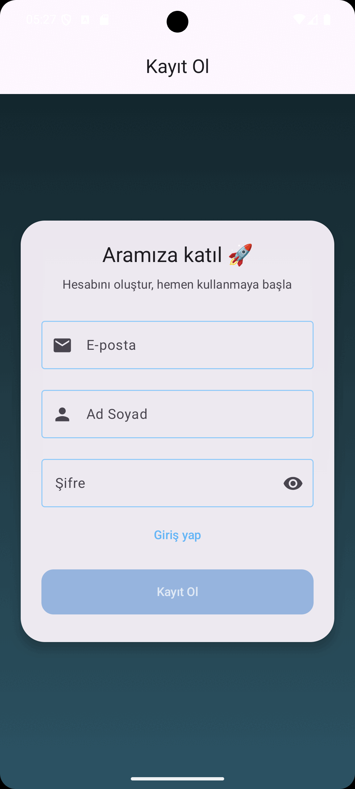
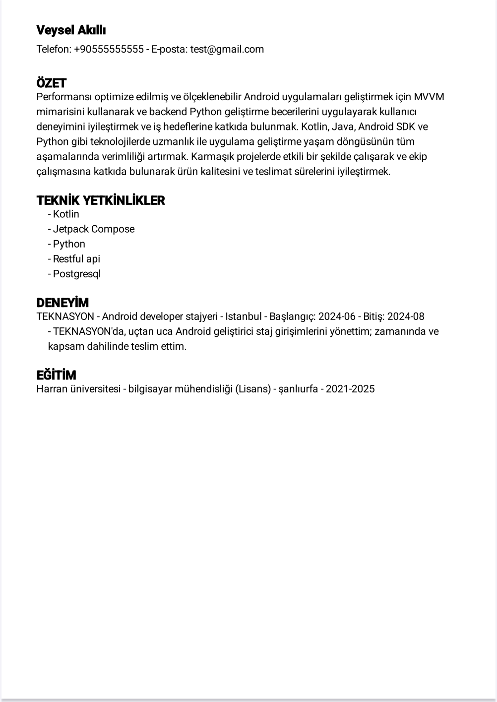

# 🚀 CV-UP – AI Powered ATS-Friendly Document Assistant

<div align="center">
  <h1>
    
    Document<em>Assistant</em>
  </h1>

  <h3>🌟 AI Destekli Belge Üretimi: CV ve daha fazlası</h3>

[](https://fastapi.tiangolo.com/)
[](https://www.postgresql.org/)
[](https://www.docker.com/)
[](https://kotlinlang.org/)
[](LICENSE)

</div>

<p align="center">
  <a href="https://github.com/Veysel-Akilli/cursor/stargazers">
    
  </a>
  <a href="https://github.com/Veysel-Akilli/cursor/network/members">
    
  </a>
  <a href="https://github.com/Veysel-Akilli/cursor/issues">
    
  </a>
  <a href="https://github.com/Veysel-Akilli/cursor/pulls">
    
  </a>
</p>

<p align="center">
  
</p>

---

## 📋 Contents

- [About the Project](#-about-the-project)
- [Why Document Assistant?](#-why-document-assistant)
- [Features](#-features)
- [Technologies](#-technologies)
- [System Architecture](#-system-architecture)
- [Project Structure](#-project-structure)
- [Installation](#️-installation)
- [API Reference](#-api-reference)
- [Mobile Application](#-mobile-application)
- [Security Notes](#-security-notes)
- [Contributing](#-contributing)
- [License](#-license)

---

## 🎯 About the Project

**Document Assistant (CV-UP)** is an AI-powered backend + mobile application designed to help users generate and manage professional documents such as **CVs**.

Unlike traditional CV generators, this project focuses on producing documents that are **ATS (Applicant Tracking System) compliant**.  
The aim is to support job seekers in preparing CVs and application documents that can successfully pass through the automated filtering systems used by companies to handle a large volume of applications.

- **Backend:** FastAPI + PostgreSQL + Docker + Gemini API
- **Mobile App:** Kotlin + Jetpack Compose (MVVM)

This combination enables **secure, scalable, and intelligent document generation**, fully integrated with a modern mobile app for seamless user experience.

---

## 🌟 Why Document Assistant?

- **🤖 Smart Document Generation** – AI-powered CVs with Gemini API.
- **⚡ Fast & Simple** – Easy integration with mobile clients via REST APIs.
- **🔒 Secure** – JWT-based authentication and role-based access control.
- **🐳 Portable** – Dockerized setup for fast deployment.

---

## 💡 Features

### 👤 For Users

- Register & login (JWT authentication)
- Create, update, list, and delete document requests
- Upload & download files with type/size validation
- Generate professional documents using Gemini API
- View personal document statistics

### 📱 For Mobile

- Kotlin + Jetpack Compose (MVVM architecture)
- Secure login & signup
- Form-based document input (CV, letters, contracts)
- Integration with backend API
- View & manage generated documents

---

## 🛠 Technologies

<div align="center">
  <table>
    <tr>
      <td align="center"><br>FastAPI</td>
      <td align="center"><br>PostgreSQL</td>
      <td align="center"><br>Docker</td>
      <td align="center"><br>Kotlin/Compose</td>
      <td align="center"><br>Python</td>
      <td align="center"><br>Gemini API</td>
      <td align="center"><br>GitHub</td>
    </tr>
  </table>
</div>

---

## 🏗 System Architecture

```
Mobile App (Kotlin + Compose + MVVM)
        │
        ▼
   FastAPI Backend ──► PostgreSQL
        │
        └── Gemini API (AI-powered text generation)
```

---

## 📂 Project Structure

```
project-root/
├── app/
│   ├── main.py                # FastAPI entry
│   ├── core/                  # Config, DB, security, middleware
│   ├── models/                # SQLAlchemy models
│   ├── schemas/               # Pydantic schemas
│   ├── routes/                # API endpoints
│   └── services/              # Business logic + Gemini
├── uploads/                   # Uploaded/generated files
├── alembic/                   # Migration files
├── docker-compose.yml         # Docker services
├── requirements.txt           # Python dependencies
├── env.example                # Example environment file
└── README.md                  # This file
```

---

## ⚙️ Installation

### 1. Clone

```bash
git clone https://github.com/Veysel-Akilli/cursor.git
cd cursor
```

### 2. Environment

```bash
cp env.example .env
# Fill in .env with your secrets
```

### 3. Run with Docker

```bash
docker-compose up --build -d
docker-compose exec app alembic upgrade head
```

- Swagger → [http://localhost:8000/docs](http://localhost:8000/docs)
- ReDoc → [http://localhost:8000/redoc](http://localhost:8000/redoc)

---

## 📘 API Reference

The **Document Assistant API** enables secure integration with external and mobile applications for ATS-compliant CV generation.

### Core Endpoints

| Endpoint                             | Method | Description                   | Access |
| ------------------------------------ | ------ | ----------------------------- | ------ |
| `/api/v1/auth/register`              | POST   | Create a new user             | Public |
| `/api/v1/auth/login`                 | POST   | User login (returns JWT)      | Public |
| `/api/v1/auth/me`                    | GET    | Get current user profile      | User   |
| `/api/v1/document-requests`          | GET    | List all document requests    | User   |
| `/api/v1/document-requests`          | POST   | Create a new request          | User   |
| `/api/v1/document-requests/{id}`     | GET    | Get a specific request        | User   |
| `/api/v1/document-requests/{id}`     | PUT    | Update a specific request     | User   |
| `/api/v1/document-requests/{id}`     | DELETE | Delete a specific request     | User   |
| `/api/v1/document-requests/generate` | POST   | Generate document (Gemini AI) | User   |
| `/api/v1/documents`                  | GET    | List user documents           | User   |
| `/api/v1/documents/upload`           | POST   | Upload a document             | User   |
| `/api/v1/documents/{id}`             | GET    | Document details              | User   |
| `/api/v1/documents/{id}/download`    | GET    | Download a document           | User   |
| `/api/v1/documents/{id}`             | PUT    | Update a document             | User   |
| `/api/v1/documents/{id}`             | DELETE | Delete a document             | User   |

For detailed API documentation, visit the **[Swagger UI](http://localhost:8000/docs)** or **[ReDoc](http://localhost:8000/redoc)** endpoints.

---

## 📱 Mobile Application

- **Stack:** Kotlin, Jetpack Compose, MVVM, Retrofit
- **Flow:** Login → Form → API `/generate` → Result
- **Screenshots:**

<p align="center">
  
</p>

---

## 🔐 Security Notes

- `.env` must **never** be committed, only `env.example`.
- Set `DEBUG=False` and restrict CORS in production.
- Secrets like `SECRET_KEY`, `POSTGRES_PASSWORD`, and `GEMINI_API_KEY` must stay private.
  -All endpoints except register/login require JWT authentication.

---

## 🤝 Contributing

1. Fork
2. Create branch (`feature/xyz`)
3. Commit
4. Push
5. Open PR

---

## 📄 License

[](LICENSE)

This project is licensed under the MIT License. For details, see the [LICENSE](LICENSE) file.

```text
MIT License

Copyright (c) 2025 Veysel Akıllı

Permission is hereby granted, free of charge, to any person obtaining a copy
of this software and associated documentation files (the "Software"), to deal
...
```
